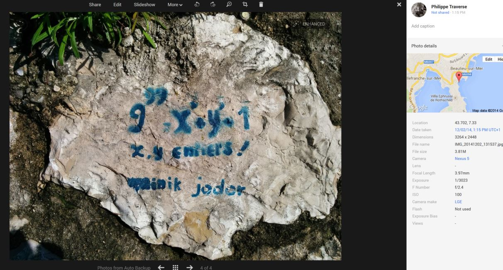

# The Beaulieu Problem

A few nights ago, I came across some interesting reading in @igorwhiletrue's blog that I would highly recommend:
<a href="https://igor.io/2014/08/06/reasoned-php.html">Reasoned PHP</a>

The source code for his project on relational programming is here:
<a href="https://github.com/igorw/reasoned-php">Github repo</a>

Lo and behold, a day or two later, I'm biking in the south of France and I see this graffiti on the wall: 

This repo is a quick demonstration of the power of relational programming for exactly this type of problem. It's not quite finished yet but I think I'm almost there...

